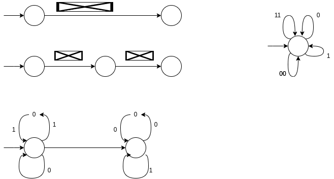

# Aula Pratica 2  
##### *Autómatos e Liguagens de Programação* | **Data:** 16/02/2021; **Hora**:16:00; **Duração**: 2h; **Sala**:CLAV_136;**Docente**: [Francisco Coelho](../../#docentes)  
### [Pagina Principal](../../)
---
## Resolução de Exercicios
## [Exercício 16](https://home.uevora.pt/~fc/alp/01-palavras_linguagens_expressoes_regulares/01.90-exercicios.html#exerc%C3%ADcio-16)  
✓ Considere a expressão regular  e o respetivo diagrama.

Encontre uma palavra que não case com esta expressão regular.
O que acontece se remover a aresta λ central do diagrama simplificado?   

---  
## [Exercício 20](https://home.uevora.pt/~fc/alp/01-palavras_linguagens_expressoes_regulares/01.90-exercicios.html#exerc%C3%ADcio-20)  
Encontre expressões regulares para representar as seguintes linguagens:  

1. ✓ A linguagem das palavras sobre ![a.b.c][abc] em que todos os `a's` precedem todos os `b's` que, por sua vez, precedem todos os `c's` (donde que todos os a's precedem todos os `c's`), podendo não haver nem `a's`, nem b's, nem `c's`.  
2. ✓ A linguagem da alínea anterior sem a palavra vazia.  
3. As palavras sobre ![a.b.c][abc] de comprimento inferior a  
4. As palavras sobre ![a.b.c][abc] que começam por `a`, acabam em `cc` e têm exatamente dois `b's`.  
5. A linguagem das palavras sobre ![a.b][ab] que têm `aa` e `bb` como subpalavras.  
6. As palavras sobre ![a.b][ab] de que `bba` não é subpalavra.  
7. ✓ A linguagem das palavras sobre ![a.b][ab] que não têm prefixo `aaa`.   
     
     
     
     
   
8. ✓ A linguagem das palavras sobre ![a.b][ab] que não têm `aaa` como subpalavra.  
9.  As palavras sobre ![a.b][ab] em que `ab` não ocorre.  
10. As palavras sobre ![a.b][ab] em que `ab` ocorre.  
11. As palavras sobre ![a.b][ab] em que `ab` ocorre só uma vez.  

[ab]: https://render.githubusercontent.com/render/math?math=\{a,b\}
[abc]: https://render.githubusercontent.com/render/math?math=\{a,b,c\}  
