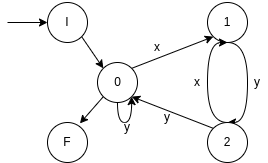

# Aula Pratica 3 
##### *Autómatos e Liguagens de Programação* | **Data:** 23/02/2021; **Hora**:16:00; **Duração**: 2h; **Sala**:CLAV_136;**Docente**: [Francisco Coelho](../../#docentes)  
### [Pagina Principal](../../) 
---
## Resolução de Exercicios
## [Exercício 3](https://home.uevora.pt/~fc/alp/02-automatos_finitos/02.90-exercicios.html#exerc%C3%ADcio-03) 
Seja A=({0,1,2},{x,y},{(0,x,1),(0,y,0),(1,x,1),(1,y,2),(2,x,1),(2,y,0)},0,{0}) um AFD.

1. desenhe o diagrama de estados  
      
        
    |a|x|y|
    |-|-|-|
    |1|1|0|
    |2|1|2|
    |3|1|0|  

2. ✓ escreva uma expressão regular que represente a linguagem reconhecida por AA
3. ✓ repita a alínea anterior para o AFD A' que apenas difere de A no conjunto dos estados de aceitação, que no caso de A é {0,1}  

---  
## [Exercício 5](https://home.uevora.pt/~fc/alp/02-automatos_finitos/02.90-exercicios.html#exerc%C3%ADcio-05) 

Construa um autómato finito determinista que reconheça a linguagem da ER   

  

|q'|a|b|
|--|-|-|
|q':fecho(a)={02}|1 V &#8709;|{3} U 3|
|1|&#8709;|{0,2}|
|3|2|&#8709;|
|&#8709;|&#8709;|&#8709;|
|2 `F`|&#8709;|3|  

---
## [Exercício 8](https://home.uevora.pt/~fc/alp/02-automatos_finitos/02.90-exercicios.html#exerc%C3%ADcio-08)   
Encontre um AFD que aceite a linguagem das palavras...  
3. com subpalavra 010 ou 101.  

   