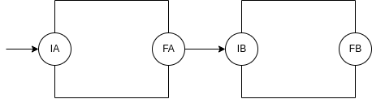
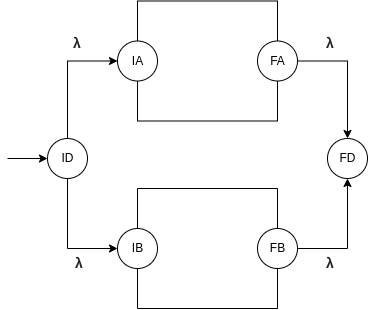
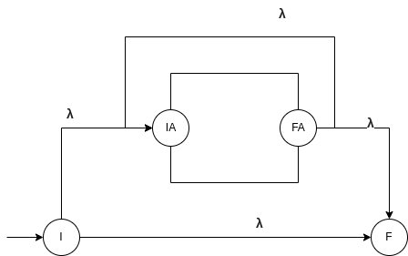
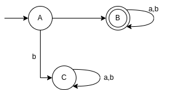
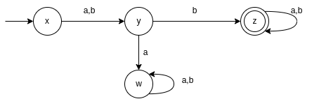
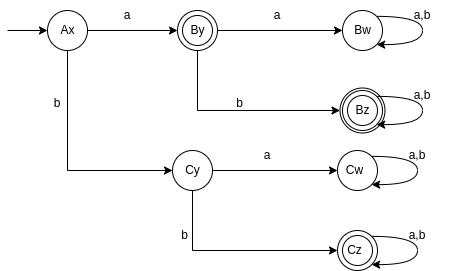

# Aula Pratica 4  
##### *Autómatos e Liguagens de Programação* | **Data:** 02/03/2021; **Hora**:16:00; **Duração**: 2h; **Sala**:CLAV_136;**Docente**: [Francisco Coelho](../../#docentes)  
### [Pagina Principal](../../)
---  

## Operações com Autómatos Finitos não Determinista  
   
 
Para realizar estas operações é precisso ter Autómatos finitos não defenidos bem preparados.  
  

|AFND|Linguagem|Operaçao|
|----|---------|--------|
|A|La=L(A)|-|
|B|Lb=L(B)|-|
|C|Lc=La.Lb|Concatenação de LR's|
|D|Ld=La U Lb|União de LR's|
|E|Le=La*|A*|   

### Exemplos  
  

  

  
  
# Interseção com Autómatos Finitos Deterministab  

   

--- 

<a href="../aula3" >Aula Anterior</a>
 <a href="../../" >Pagina Principal</a>
<a href="../aula5" >Proxima Aula</a>

