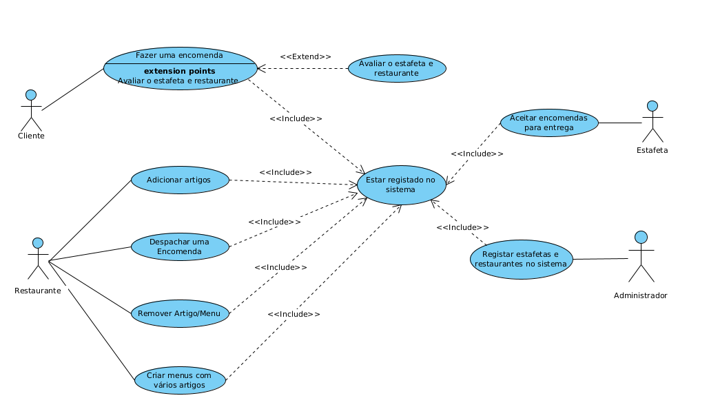

- [Fazer  Encomenda](use%20cases/useCase1)  
- [Avaliar Encomenda](use%20cases/useCase2)  
- [Adicionar Artigo](use%20cases/useCase3)  
- [Despachar Encomenda](use%20cases/useCase4)  
- [Criar Menus](use%20cases/useCase5)  
- [Aceitar Encomenda E Entrega](use%20cases/useCase6)  
- [Registar Restaurante/Estafeta](use%20cases/useCase7)  
- [Remover Artigo/Menu](use%20cases/useCase8)  