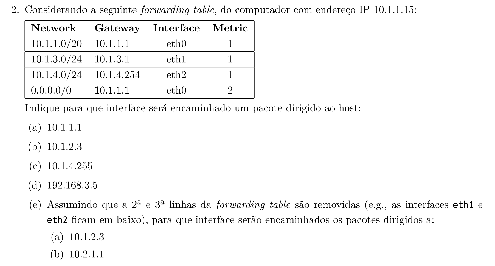
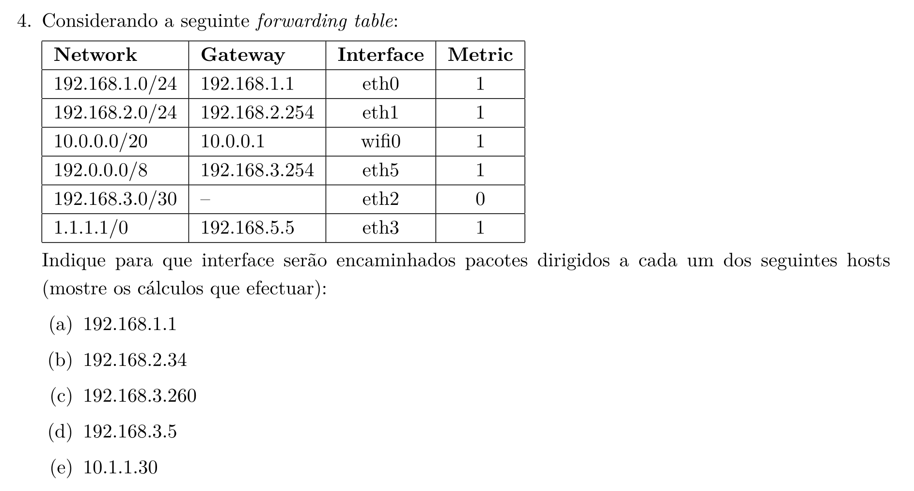

# Aula Pratica 8   
##### *Redes de Computadores* | **Data:** 19/04/2021; **Hora**:13:30; **Duração**: 2h; **Sala**:CLAV_139; **Docente**: [Pedro Salgueiro](../#docentes)  
### [Pagina Principal](../)
---  
  

---  

<a href="../Lab07" >Aula Anterior</a>
 <a href="../" >Pagina Principal</a>
<a href="../Lab09" >Proxima Aula</a>

  

---  

