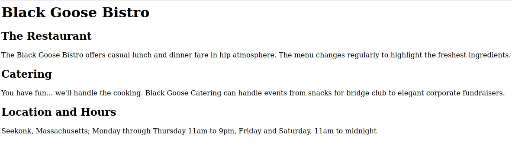
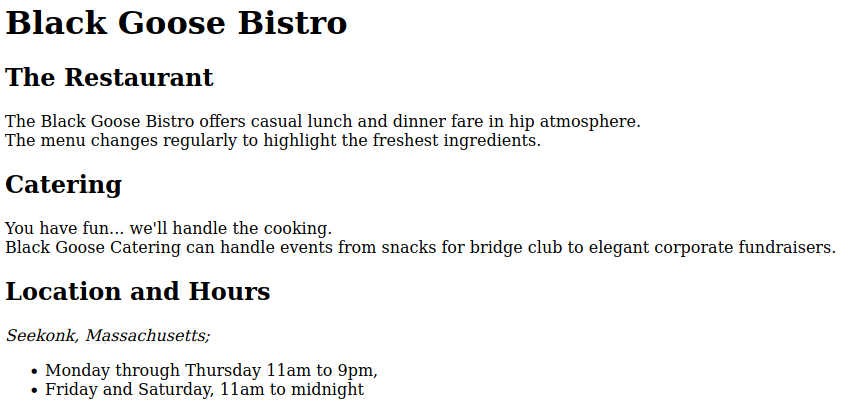
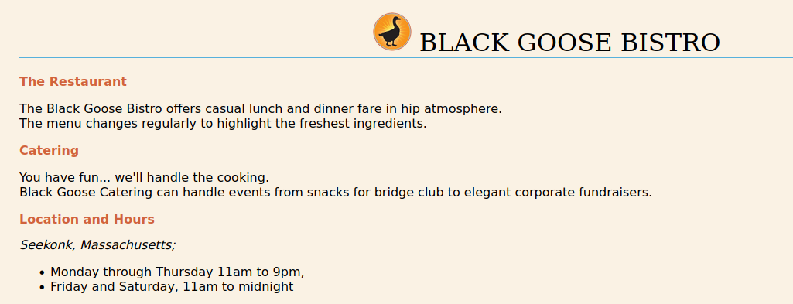
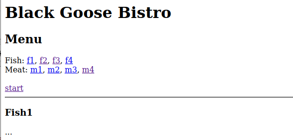

# Aula Pratica 2  
##### *Tecnologias Web* | **Data:** 19/09/2021; **Hora**:11:00; **Duração**: 2H ; **Sala**:CLAV_137;**Docente**: [José Saias](../#docentes)  
### [Pagina Principal](../)  
---
## A - Sintaxe para conteúdo comum
Aceda ao [tutorial online sobre HTML](https://www.w3schools.com/html/) do W3C,
e veja as secções:

- basic  
- elements  
- attributes  
- headings,   
- links  
- lists ul+ol  
- images (sem CSS)  

Em cada secção, analise a sintaxe HTML e também o aspeto resultante, usando o simulador (botão) "Try it Yourself".


## B- Conteúdo Web alojado localmente  
### Tarefa 01
**Esta tarefa tem como objectivo introduzir os conceitos básicos associados à criação de uma página Web, incluindo a estrutura de documentos HTML, alguns elementos de HTML e páginas de estilos. Para tal, os alunos devem realizar as seguintes tarefas respeitando a ordem apresentada:**

1. Criar uma pasta na área pessoal com o nome “BlackGooseBistro”;

1. Na pasta “BlackGooseBistro”, criar um ficheiro com o nome “index.html”;

1. Colocar o conteúdo do seguinte ficheiro no ficheiro “index.html”

1. Abrir o ficheiro “index.html” num Browser Web à escolha;

1. Estruturar a página:  
    1. Adicionar elementos HTML: head; title e body

1. Voltar ao browser e fazer reload da página;
    1. Analisar as diferenças;

1. Identificar elementos de texto:
    1. Adicionar elementos HTML h1 e h2
    1. Voltar ao browser e fazer reload da página; ver diferenças...
        1. espera-se algo semelhante a:  
          

1. Adicionar elementos HTML: p, em, ul, br
    1. Voltar ao browser e fazer reload da página; ver diferenças...
    1. Espera-se algo semelhante a:
  

1. Descarregar a [seguinte imagem](../Praticas/BlackGooseBistro/blackgoose.png) e guardá-la na pasta “BlackGooseBistro”, com o nome “blackgoose.png”:   
    1. Adicionar a imagem, no início da página, dentro do cabeçalho de nível 1, com 50 pixeis de altura;
    1. Voltar ao browser e fazer reload da página; Analisar as diferenças;

10. Adicionar o [seguinte estilo CSS]() à página com o elemento HTML style (modo interno... não é o modo externo!).
    1. Recarregar a página e ver as diferenças.
  


1. Na pasta “BlackGooseBistro”, iniciar um servidor Web simples: 
    1. `python3 -m http.server 8080`  
        - se não tiver este módulo instalado
            - sudo pip3 install httpserver  
(não tem pip3?  sudo apt install python3-pip )

1. No Browser Web, aceder à pagina criada, servida através do servidor Web:
    1. http://localhost:8080/index.html

1. Analisar os logs do servidor Web;

1. No browser, inspecionar a página, escolher a opção “Network” ou “Rede”:
    1. Fazer reload da página;
    1. Analisar o tráfego de rede;

1. Crie um novo ficheiro na mesma pasta, com o nome menu.html, com o conteúdo seguinte.

1. No primeiro documento (index.html), junte um novo apontador textual para o menu, com o valor "menu".

1. No documento menu.html, defina fragmentos em cada opção do menu,
e junte no topo um apontador direto para cada um desses pratos (fragmentos). Adicionalmente, deve ter um apontador "start", para a página inicial.  
Exemplo:  



18. Troque o conteúdo do apontador em 16 para uma imagem do tipo SVG, à sua escolha.
19. Se os logs mostrarem:
``` bash
127.0.0.1 - - [16/Sep/2021 09:16:52] code 404, message File not found
127.0.0.1 - - [16/Sep/2021 09:16:52] "GET /favicon.ico HTTP/1.1" 404 -
```
Adicione a seguinte imagem com o icom para esta página (dentro do elemento head):
``` html
<link rel="icon" href="https://www.uevora.pt/extension/uepages/design/ueresponsive_layout1/images/favicon.ico" type="image/x-icon">
```
